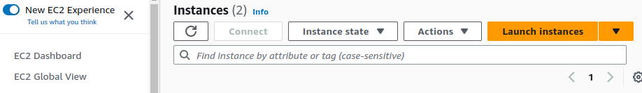
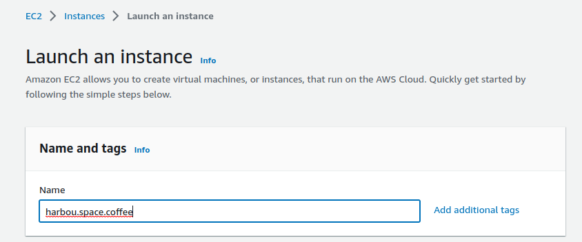
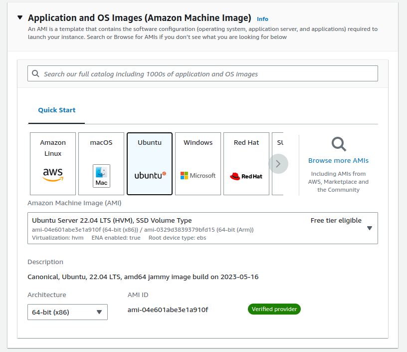
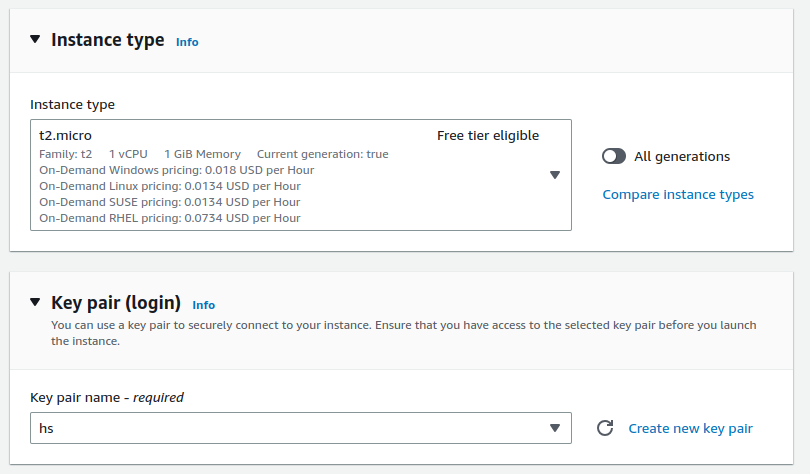
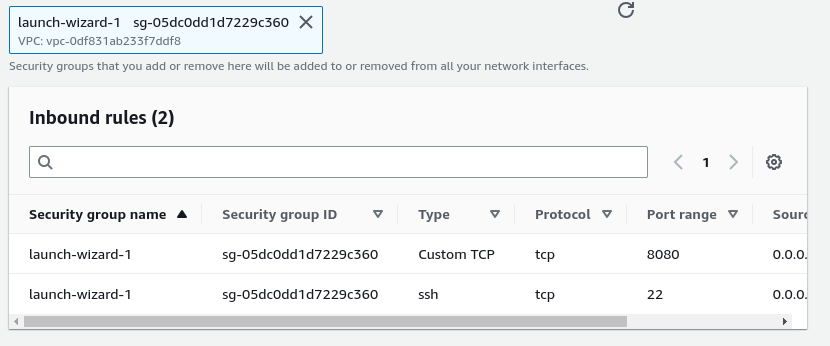
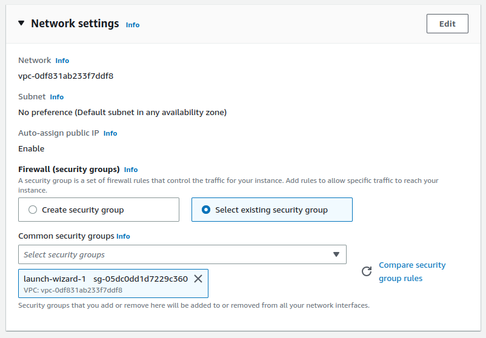
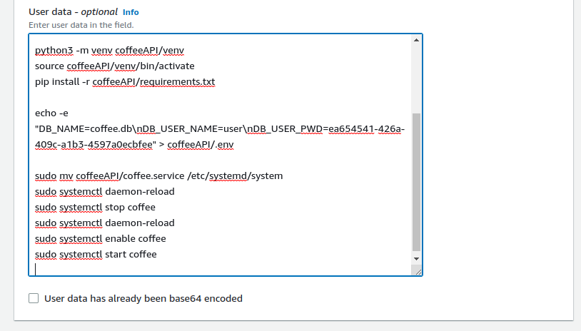
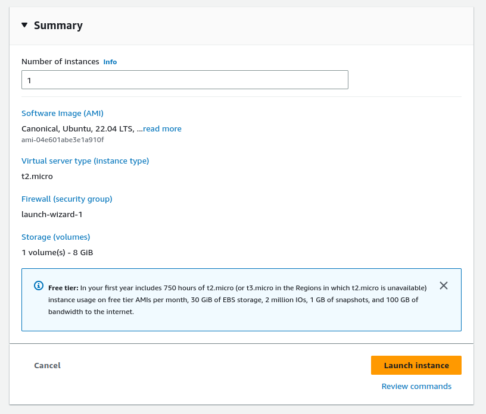
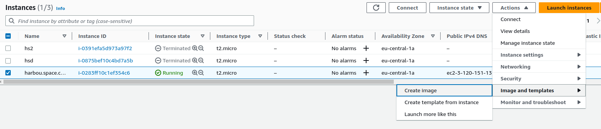
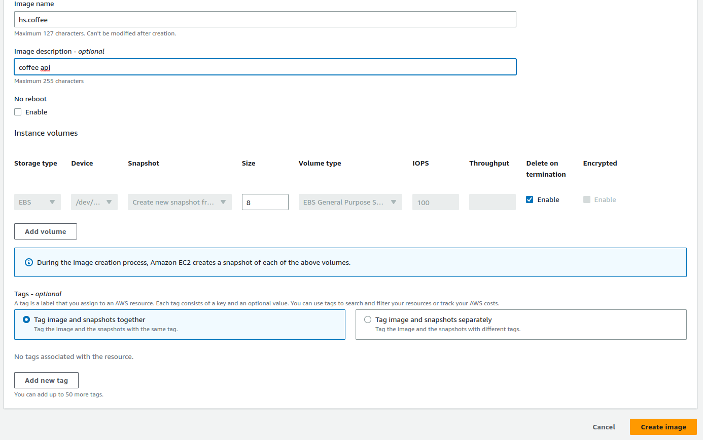

# How to create an EC2 and an AMI

## EC2

First, in the AWS console, launch an EC2 instance:

then name the image (in the example harbour.space.coffee),

select the ubuntu image

for the key-pair, create one and imported to your local machine or import one from your machine. In the example it was selected hs key.

for the security group, create\select one with the port 8080 enabled and ssh port enabled too.

 

Then in the Avanced details, in User data paste the content of the file aws_userdata on it.

launch the instance.

## AMI

To create the image from the EC2, select the instance, go to Actions->Image and templates->Create image:

give a name to it then save it.

